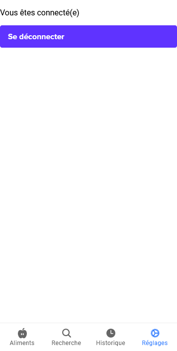

# Eatnet
A small project using PlantNetAPI to identify plants then displays if the plant is eadible by some animals

## Techno used
### Global
Docker
### Backend
NodeJS with Express, Redis, Knex, Morgan, Jest
### Frontend
Ionic with React and Capacitor

## How to run this project ?

- Create a Plantnet developer account here (https://my.plantnet.org/signup) in order to have a (free) developer plantnet api key
- Set environment variables ('SET_XXXX') with your values in docker-compose.yaml
- Run ***`dependencies_installer.sh`*** script to install dependencies in *`api`* folder and *`react-ui`* folder
- Run ***`docker-compose -f {DOCKER_FILE_TO_RUN} up --build`*** from project root folder
```
docker-compose -f docker-compose.dev.yaml up --build -d
```

For debugging purposes, you can access directly a Docker container by running the above command:
```
// start a single container (where: {SERVICE_NAME} = api, postgres, react-ui, redis)
docker-compose -f docker-compose.dev.yaml up --build {SERVICE_NAME}

// access directly a Docker container {SERVICE_NAME} = api, postgres, react-ui, redis)
docker exec -it eatnet-{SERVICE_NAME} /bin/bash

// check the status of all running containers:
docker ps -a

```

Run react-ui in browser with:
```
cd ./react-ui
ionic serve
```

Run api tests with:
```
docker exec eatnet-api-dev sh -c "npm run test"
```

Explore database at localhost:5050 using credentials set in pgadmin container definition

***Make sure you use postgreSQL instead of mySQL for this code base.***

## Variables to replace
- SET_YOUR_USER: ex. admin
- SET_YOUR_PASSWORD: ex. password
- SET_YOUR_PGADMIN_EMAIL: ex. admin@admin.com
- SET_YOUR_PGADMIN_PASSWORD: ex. password
- SET_API_URL: ex. http://127.0.0.1:80
- SET_PLANTNET_APIKEY (only used when testing with Jest): ex. 5g8s4g8c5df987gdq213dg4ds


## App preview
### --- "Réglages" tab ---
#### Register

#### Sign in

#### User connected

### --- "Aliments" tab ---
#### Plant list

#### Scroll menu to letter M

#### Search by name

#### Filtering

#### Results from filter

### --- "Recherche" tab ---
#### Search form

#### Choosing referential to optimize analysis

#### Choosing image to analyse, either from the gallery or from camera

#### Defining which organ the image is reflecting to optimize analysis

#### Results
